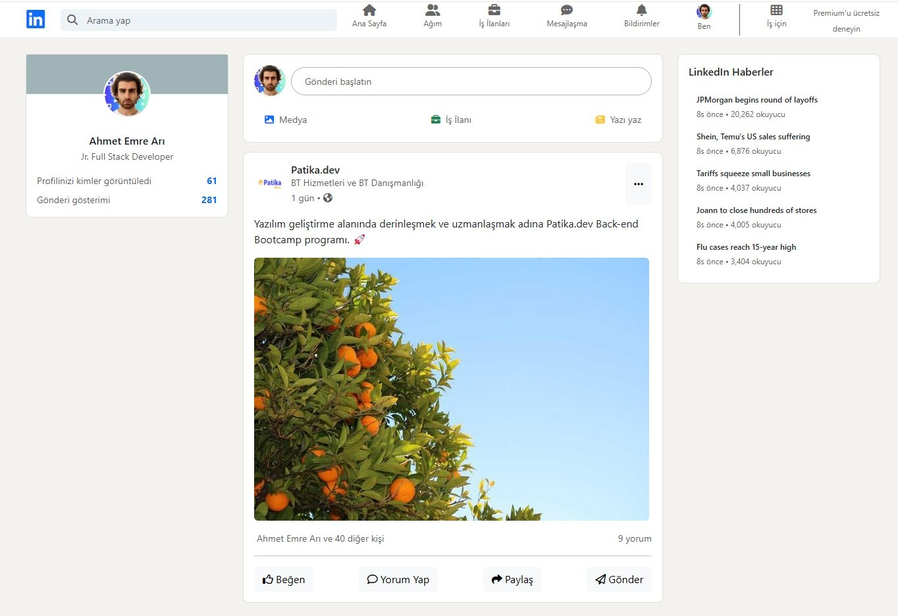

# LinkedIn Clone



Bu proje, Bootstrap ve Font Awesome kullanılarak oluşturulmuş bir LinkedIn klonudur.

This project is a LinkedIn clone created using Bootstrap and Font Awesome.

## 🚀 Özellikler | Features

### 🇹🇷 Türkçe
- Responsive tasarım
- Bootstrap 5 entegrasyonu
- Font Awesome ikonları
- Gerçek LinkedIn arayüzüne benzer görünüm
- Gönderi paylaşma arayüzü
- Haber akışı
- Profil kartı

### 🇬🇧 English
- Responsive design
- Bootstrap 5 integration
- Font Awesome icons
- Similar appearance to real LinkedIn interface
- Post sharing interface
- News feed
- Profile card

## 🛠️ Kurulum | Installation

### 🇹🇷 Türkçe
1. Projeyi klonlayın:
```bash
git clone https://github.com/ahmetemreari/BootstrapLinkedinClone.git
```

2. Proje dizinine gidin:
```bash
cd linkedin-clone
```

3. `index.html` dosyasını bir web tarayıcısında açın veya bir lokalhost sunucusu kullanın.

### 🇬🇧 English
1. Clone the project:
```bash
git clone https://github.com/ahmetemreari/BootstrapLinkedinClone.git
```

2. Navigate to project directory:
```bash
cd linkedin-clone
```

3. Open `index.html` in a web browser or use a localhost server.

## 📁 Proje Yapısı | Project Structure

```
linkedin-clone/
│
├── index.html
├── img/
│   ├── profilemre.jpg
│   └── gonderi.jpg
├── screenshots/
│   └── ss1.jpg
└── README.md
```

## 🔧 Teknolojiler | Technologies

- HTML5
- CSS3
- Bootstrap 5.3.2
- Font Awesome 6.4.2

## 📱 Responsive Tasarım | Responsive Design

Proje, farklı ekran boyutlarında düzgün görüntülenecek şekilde tasarlanmıştır:
- Mobil cihazlar
- Tabletler
- Masaüstü bilgisayarlar

The project is designed to display properly on different screen sizes:
- Mobile devices
- Tablets
- Desktop computers

## 🤝 Katkıda Bulunma | Contributing

### 🇹🇷 Türkçe
1. Bu depoyu fork edin
2. Yeni bir özellik dalı oluşturun (`git checkout -b yeni-ozellik`)
3. Değişikliklerinizi commit edin (`git commit -am 'Yeni özellik eklendi'`)
4. Dalınıza push yapın (`git push origin yeni-ozellik`)
5. Bir Pull Request oluşturun

### 🇬🇧 English
1. Fork this repository
2. Create a new feature branch (`git checkout -b new-feature`)
3. Commit your changes (`git commit -am 'Added new feature'`)
4. Push to the branch (`git push origin new-feature`)
5. Create a Pull Request

## 📝 Lisans | License

Bu proje MIT lisansı altında lisanslanmıştır. Detaylar için [LICENSE](LICENSE) dosyasına bakınız.

This project is licensed under the MIT License. See the [LICENSE](LICENSE) file for details.

## 👏 Teşekkürler | Acknowledgments

